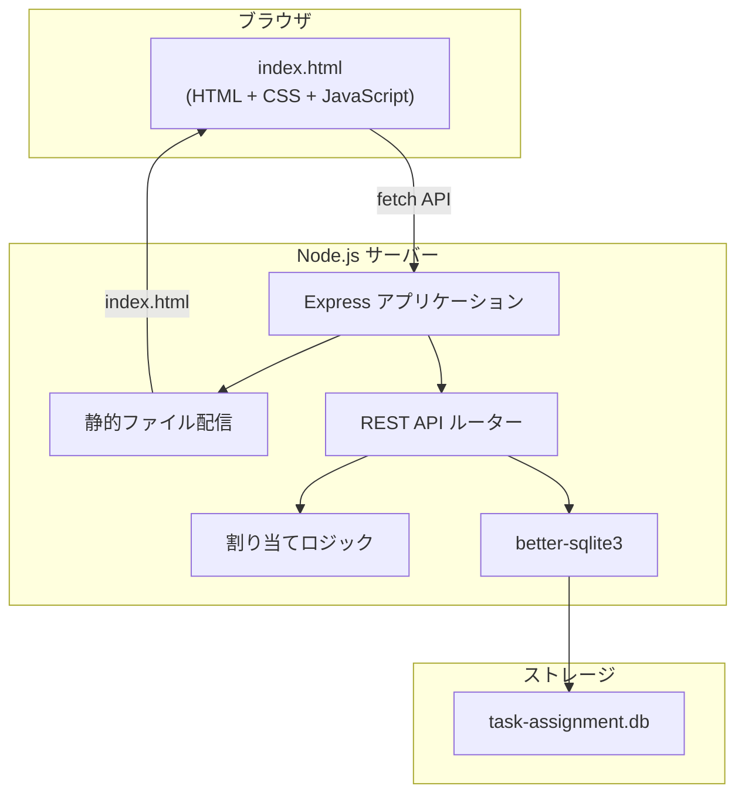
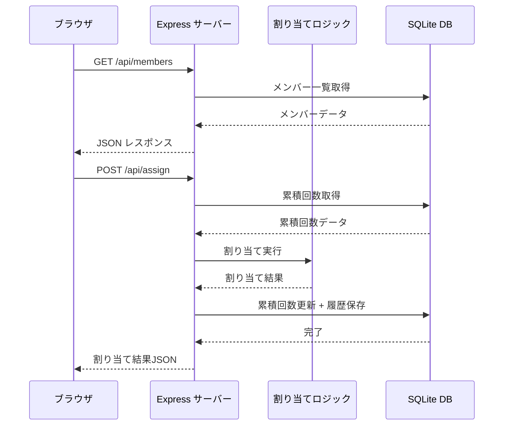
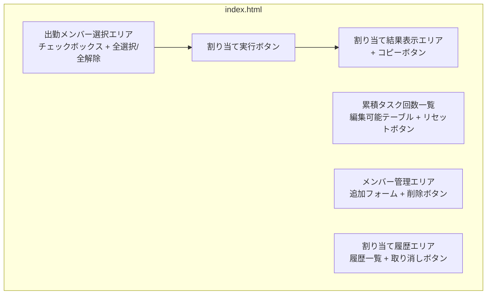
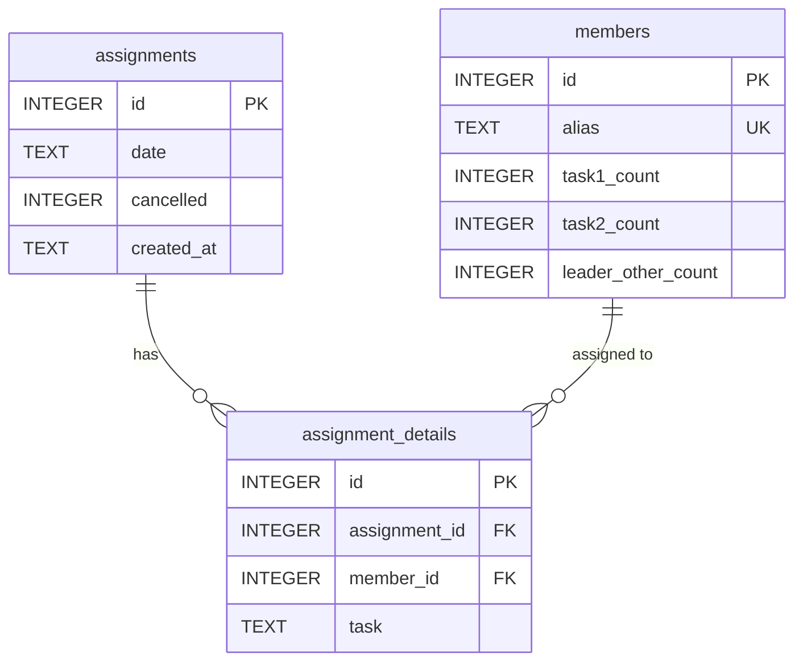

# 技術設計書: タスク割り当てアプリ

## 概要

チーム内の日次タスク割り当てを自動化するWebアプリケーションの技術設計書。Node.js + Express + SQLiteによるバックエンドと、単一HTMLファイルによるフロントエンドで構成される。25名のチームメンバーを3つの固定タスク（タスク1、タスク2、Leader&Other）に公平に割り当て、累積タスク回数を管理する。

### 技術スタック

- バックエンド: Node.js + Express
- データベース: SQLite（better-sqlite3ライブラリ使用）
- フロントエンド: 単一HTMLファイル（vanilla HTML/CSS/JavaScript）
- 認証: なし

### 設計方針

- シンプルさを最優先とし、最小限の依存関係で構成する
- better-sqlite3を使用し、同期的なSQLite操作で実装を簡素化する
- フロントエンドはフレームワーク不使用、fetch APIでバックエンドと通信する
- REST APIを通じてフロントエンドとバックエンドの責務を明確に分離する

## アーキテクチャ

### システム構成図



### ディレクトリ構成

```
task-assignment-app/
├── server.js          # Expressサーバー + APIルート定義
├── db.js              # データベース初期化・操作モジュール
├── assign.js          # タスク割り当てアルゴリズム
├── public/
│   └── index.html     # フロントエンド（単一HTMLファイル）
├── package.json
└── task-assignment.db # SQLiteデータベースファイル（自動生成）
```

### リクエストフロー




## コンポーネントとインターフェース

### バックエンドコンポーネント

#### 1. server.js - Expressサーバー

アプリケーションのエントリーポイント。静的ファイル配信とAPIルーティングを担当する。

```javascript
// 主要な責務
// - Expressアプリケーションの初期化
// - 静的ファイル配信（public/ディレクトリ）
// - APIルートの定義
// - サーバー起動（ポート3000）
```

#### 2. db.js - データベースモジュール

SQLiteデータベースの初期化と全てのデータ操作を提供する。

```javascript
// エクスポートする関数
initializeDatabase()          // テーブル作成・初期データ投入
getMembers()                  // メンバー一覧と累積回数取得
getMemberById(id)             // 特定メンバー取得
addMember(alias)              // メンバー追加
deleteMember(id)              // メンバー削除
updateTaskCount(id, task, count) // 累積回数更新
incrementTaskCounts(assignments) // 割り当て後の累積回数一括増加
decrementTaskCounts(assignmentId) // 取り消し時の累積回数一括減少
resetAllCounts()              // 全累積回数リセット
saveAssignment(date, assignments) // 割り当て履歴保存
getAssignments()              // 割り当て履歴取得
cancelAssignment(id)          // 割り当て取り消し
```

#### 3. assign.js - 割り当てアルゴリズム

タスク割り当てのコアロジックを提供する。純粋関数として実装し、テスト容易性を確保する。

```javascript
// エクスポートする関数
assignTasks(members)
// 入力: メンバー配列 [{ id, alias, task1_count, task2_count, leader_other_count }]
// 出力: { task1: [alias, ...], task2: [alias, ...], leader_other: [alias, ...] }
```

**割り当てアルゴリズムの詳細:**

1. 出勤メンバー数 `n` を3で割り、各タスクの基本人数 `base = Math.floor(n / 3)` を算出
2. 余り `remainder = n % 3` を計算
3. 各タスクの人数を決定:
   - `leader_other`: `base + (remainder >= 1 ? 1 : 0)`
   - `task2`: `base + (remainder >= 2 ? 1 : 0)`
   - `task1`: `base`
4. 各タスクについて、メンバーをそのタスクの累積回数の昇順でソートし、上位から必要人数を割り当てる
5. 一度割り当てられたメンバーは他のタスクの候補から除外する
6. 割り当て順序: Leader&Other → タスク2 → タスク1（優先度の高いタスクから先に割り当て）

### REST APIインターフェース

| メソッド | パス | 説明 | リクエストボディ | レスポンス |
|---------|------|------|----------------|-----------|
| GET | `/api/members` | メンバー一覧取得 | - | `{ members: [{ id, alias, task1_count, task2_count, leader_other_count }] }` |
| POST | `/api/members` | メンバー追加 | `{ alias: string }` | `{ member: { id, alias, task1_count, task2_count, leader_other_count } }` |
| DELETE | `/api/members/:id` | メンバー削除 | - | `{ success: true }` |
| POST | `/api/assign` | タスク割り当て実行 | `{ memberIds: [number] }` | `{ assignment: { id, date, task1: [alias], task2: [alias], leader_other: [alias] } }` |
| PUT | `/api/members/:id/counts` | 累積回数更新 | `{ task: string, count: number }` | `{ member: { id, alias, task1_count, task2_count, leader_other_count } }` |
| POST | `/api/reset` | 累積回数一括リセット | - | `{ success: true }` |
| GET | `/api/assignments` | 割り当て履歴取得 | - | `{ assignments: [{ id, date, cancelled, details: [{ alias, task }] }] }` |
| PUT | `/api/assignments/:id/cancel` | 割り当て取り消し | - | `{ success: true }` |

### フロントエンドコンポーネント

#### index.html の構成

単一HTMLファイル内に以下のセクションを配置する:

1. **出勤メンバー選択エリア**: チェックボックス付きメンバー一覧、全員選択/全員解除ボタン
2. **割り当て実行ボタン**: 選択されたメンバーでタスク割り当てを実行
3. **割り当て結果表示エリア**: 最新の割り当て結果、コピーボタン
4. **累積タスク回数一覧**: 編集可能なテーブル、リセットボタン
5. **メンバー管理エリア**: メンバー追加フォーム、削除ボタン
6. **割り当て履歴エリア**: 過去の割り当て結果一覧、取り消しボタン




## データモデル

### SQLiteテーブル設計

#### membersテーブル

メンバー情報と累積タスク回数を管理する。

```sql
CREATE TABLE IF NOT EXISTS members (
    id INTEGER PRIMARY KEY AUTOINCREMENT,
    alias TEXT NOT NULL UNIQUE,
    task1_count INTEGER NOT NULL DEFAULT 0,
    task2_count INTEGER NOT NULL DEFAULT 0,
    leader_other_count INTEGER NOT NULL DEFAULT 0
);
```

| カラム | 型 | 説明 |
|-------|-----|------|
| id | INTEGER | 主キー（自動採番） |
| alias | TEXT | メンバーのエイリアス名（ユニーク制約） |
| task1_count | INTEGER | タスク1の累積回数（デフォルト0） |
| task2_count | INTEGER | タスク2の累積回数（デフォルト0） |
| leader_other_count | INTEGER | Leader&Otherの累積回数（デフォルト0） |

#### assignmentsテーブル

割り当て実行の履歴を管理する。

```sql
CREATE TABLE IF NOT EXISTS assignments (
    id INTEGER PRIMARY KEY AUTOINCREMENT,
    date TEXT NOT NULL,
    cancelled INTEGER NOT NULL DEFAULT 0,
    created_at TEXT NOT NULL DEFAULT (datetime('now', 'localtime'))
);
```

| カラム | 型 | 説明 |
|-------|-----|------|
| id | INTEGER | 主キー（自動採番） |
| date | TEXT | 割り当て実行日（YYYY-MM-DD形式） |
| cancelled | INTEGER | 取り消しフラグ（0: 有効, 1: 取り消し済み） |
| created_at | TEXT | レコード作成日時 |

#### assignment_detailsテーブル

各割り当ての詳細（どのメンバーがどのタスクに割り当てられたか）を管理する。

```sql
CREATE TABLE IF NOT EXISTS assignment_details (
    id INTEGER PRIMARY KEY AUTOINCREMENT,
    assignment_id INTEGER NOT NULL,
    member_id INTEGER NOT NULL,
    task TEXT NOT NULL,
    FOREIGN KEY (assignment_id) REFERENCES assignments(id),
    FOREIGN KEY (member_id) REFERENCES members(id)
);
```

| カラム | 型 | 説明 |
|-------|-----|------|
| id | INTEGER | 主キー（自動採番） |
| assignment_id | INTEGER | 割り当てID（外部キー） |
| member_id | INTEGER | メンバーID（外部キー） |
| task | TEXT | タスク名（'task1', 'task2', 'leader_other'） |

### 初期データ

アプリケーション初回起動時に以下の25名を累積回数0で登録する:

```
nozayuka, yosihatt, uekeisu, koniryo, yonghyun, sawmadok, riikaa, sakagyun,
nyunn, yamshoic, daikikk, cseungj, sagawa, takumr, ryoanz, wyamash,
yamkohe, yosmi, isswada, mizoyuka, kitetsu, curakawa, reonwata, ayakura, yuukaigt
```

### データフロー




## 正当性プロパティ

*プロパティとは、システムの全ての有効な実行において成り立つべき特性や振る舞いのことです。人間が読める仕様と機械的に検証可能な正当性保証の橋渡しとなる、形式的な記述です。*

### Property 1: 全メンバーの割り当て完全性

*任意の*出勤メンバーリスト（1名以上）に対して、割り当てアルゴリズムを実行した結果、全ての出勤メンバーがタスク1、タスク2、Leader&Otherのいずれか1つに割り当てられ、かつ重複なく割り当てられること。

**Validates: Requirements 2.1**

### Property 2: タスク人数の正確な分配

*任意の*出勤メンバー数 `n`（1以上）に対して、割り当てアルゴリズムを実行した結果:
- `base = Math.floor(n / 3)`, `remainder = n % 3` として
- Leader&Otherの人数 = `base + (remainder >= 1 ? 1 : 0)`
- タスク2の人数 = `base + (remainder >= 2 ? 1 : 0)`
- タスク1の人数 = `base`
が成り立つこと。

**Validates: Requirements 2.2, 2.3**

### Property 3: 累積回数優先割り当て

*任意の*メンバーセット（各メンバーが任意の累積回数を持つ）に対して、割り当てアルゴリズムを実行した結果、各タスクに割り当てられたメンバーのそのタスクの累積回数が、同じタスクに割り当てられなかったメンバーの累積回数以下であること。

**Validates: Requirements 2.4**

### Property 4: 割り当て・取り消しのラウンドトリップ

*任意の*メンバーセットに対して、割り当てを実行した後に取り消しを実行すると、全メンバーの累積タスク回数が割り当て前の値に戻ること。

**Validates: Requirements 2.6, 9.2**

### Property 5: 累積回数更新のラウンドトリップ

*任意の*メンバーIDと有効なタスク名と非負整数の回数に対して、累積回数を更新した後に取得すると、更新した値と一致すること。

**Validates: Requirements 4.3, 5.1**

### Property 6: 不正リクエストのエラーレスポンス

*任意の*不正なリクエスト（存在しないメンバーID、無効なタスク名、負の回数値など）に対して、APIは4xxステータスコードとエラーメッセージを含むJSONレスポンスを返すこと。

**Validates: Requirements 6.4**

### Property 7: 割り当て履歴の保存と取得

*任意の*割り当て実行に対して、履歴取得APIを呼び出すと、実行日時、割り当てられたメンバーのエイリアス名、タスク名が全て含まれた履歴レコードが返されること。

**Validates: Requirements 8.1, 8.5**

### Property 8: 履歴の日付降順

*任意の*複数回の割り当て実行後、履歴取得APIの結果が作成日時の降順で並んでいること。

**Validates: Requirements 8.2**

### Property 9: 取り消し済みマーク

*任意の*有効な割り当てに対して取り消しを実行すると、該当履歴レコードのcancelledフラグがtrueになること。また、既に取り消し済みの割り当てに対する再取り消しはエラーとなること。

**Validates: Requirements 9.3, 9.5**

### Property 10: メンバー追加・削除のラウンドトリップ

*任意の*ユニークなエイリアス名に対して、メンバーを追加すると累積回数が全て0で登録され、その後削除するとメンバー一覧から消えること。

**Validates: Requirements 10.2, 10.5**

### Property 11: 累積回数一括リセット

*任意の*累積回数状態（各メンバーが任意の非負整数の累積回数を持つ）に対して、リセットを実行すると全メンバーの全タスクの累積回数がゼロになること。

**Validates: Requirements 11.3**

### Property 12: コピーテキストフォーマット

*任意の*割り当て結果（各タスクに1名以上のメンバー）と実行日に対して、生成されるコピーテキストが「■ 本日（YYYY/MM/DD）のタスク割り振り\nタスク1：〇〇、〇〇\nタスク2：〇〇、〇〇\nLeader＆Other：〇〇、〇〇」のフォーマットに従い、全メンバーのエイリアス名が含まれ、日付がYYYY/MM/DD形式であること。

**Validates: Requirements 13.2, 13.5**


## エラーハンドリング

### バックエンドエラーハンドリング

#### APIレベルのエラー

| エラー種別 | HTTPステータス | レスポンス例 | 発生条件 |
|-----------|--------------|-------------|---------|
| バリデーションエラー | 400 | `{ "error": "エイリアス名は必須です" }` | 必須パラメータ欠落、無効な値 |
| 重複エラー | 409 | `{ "error": "このエイリアス名は既に登録されています" }` | 既存エイリアスでのメンバー追加 |
| 存在しないリソース | 404 | `{ "error": "メンバーが見つかりません" }` | 存在しないIDでの操作 |
| 取り消し済みエラー | 400 | `{ "error": "この割り当ては既に取り消し済みです" }` | 取り消し済み割り当ての再取り消し |
| 出勤メンバー不足 | 400 | `{ "error": "出勤メンバーを1名以上選択してください" }` | 0名での割り当て実行 |
| サーバーエラー | 500 | `{ "error": "内部サーバーエラーが発生しました" }` | DB接続エラー等 |

#### バリデーションルール

- **エイリアス名**: 空文字列・空白のみは不可、UNIQUE制約
- **タスク名**: 'task1', 'task2', 'leader_other' のいずれかのみ許可
- **累積回数**: 非負整数のみ許可
- **メンバーID**: 正の整数、存在するメンバーのみ
- **割り当て実行**: 出勤メンバーが1名以上必要

#### データベースエラー

- テーブル作成失敗時: アプリケーション起動を中止し、エラーログを出力
- トランザクション失敗時: ロールバックを実行し、500エラーを返却
- 割り当て実行時は累積回数更新と履歴保存をトランザクションで一括処理し、部分的な更新を防止

### フロントエンドエラーハンドリング

- API通信エラー時: 画面上にエラーメッセージを表示（アラートまたはトースト通知）
- ネットワークエラー時: 「サーバーに接続できません」メッセージを表示
- クリップボードコピー失敗時: エラーメッセージを表示
- 全てのfetch呼び出しでtry-catchを使用し、エラーをユーザーに通知

## テスト戦略

### テストアプローチ

ユニットテストとプロパティベーステストの二重アプローチで包括的なテストカバレッジを実現する。

#### ユニットテスト

- テストフレームワーク: **Jest**
- 対象: 具体的な例、エッジケース、エラー条件
- 主なテスト対象:
  - DB初期化（25名の初期登録確認）
  - APIエンドポイントの基本動作（各エンドポイントの正常系）
  - 重複エイリアスのエラーハンドリング
  - 取り消し済み割り当ての再取り消しエラー
  - 全員選択/全員解除の動作（DOMテスト）
  - 静的ファイル配信の確認

#### プロパティベーステスト

- テストライブラリ: **fast-check**（JavaScriptのプロパティベーステストライブラリ）
- 各テストは最低100回のイテレーションで実行
- 各テストにはデザインドキュメントのプロパティ番号をコメントで参照

##### プロパティテスト一覧

| テスト | プロパティ | タグ |
|-------|----------|------|
| 割り当て完全性テスト | Property 1 | `Feature: task-assignment-app, Property 1: 全メンバーの割り当て完全性` |
| タスク人数分配テスト | Property 2 | `Feature: task-assignment-app, Property 2: タスク人数の正確な分配` |
| 累積回数優先テスト | Property 3 | `Feature: task-assignment-app, Property 3: 累積回数優先割り当て` |
| 割り当て・取り消しラウンドトリップテスト | Property 4 | `Feature: task-assignment-app, Property 4: 割り当て・取り消しのラウンドトリップ` |
| 累積回数更新ラウンドトリップテスト | Property 5 | `Feature: task-assignment-app, Property 5: 累積回数更新のラウンドトリップ` |
| 不正リクエストエラーテスト | Property 6 | `Feature: task-assignment-app, Property 6: 不正リクエストのエラーレスポンス` |
| 履歴保存・取得テスト | Property 7 | `Feature: task-assignment-app, Property 7: 割り当て履歴の保存と取得` |
| 履歴日付降順テスト | Property 8 | `Feature: task-assignment-app, Property 8: 履歴の日付降順` |
| 取り消し済みマークテスト | Property 9 | `Feature: task-assignment-app, Property 9: 取り消し済みマーク` |
| メンバー追加・削除ラウンドトリップテスト | Property 10 | `Feature: task-assignment-app, Property 10: メンバー追加・削除のラウンドトリップ` |
| 累積回数リセットテスト | Property 11 | `Feature: task-assignment-app, Property 11: 累積回数一括リセット` |
| コピーテキストフォーマットテスト | Property 12 | `Feature: task-assignment-app, Property 12: コピーテキストフォーマット` |

##### テスト構成

- Property 1〜3: `assign.js`の純粋関数に対するテスト（DBアクセス不要）
- Property 4〜11: `db.js`のデータ操作に対するテスト（テスト用インメモリDBまたは一時ファイルDB使用）
- Property 12: コピーテキスト生成関数に対するテスト（純粋関数）

##### fast-checkジェネレータ設計

- メンバーリスト: `fc.array(fc.record({ id: fc.nat(), alias: fc.string(), task1_count: fc.nat(), task2_count: fc.nat(), leader_other_count: fc.nat() }), { minLength: 1, maxLength: 50 })`
- タスク名: `fc.constantFrom('task1', 'task2', 'leader_other')`
- エイリアス名: `fc.string({ minLength: 1 }).filter(s => s.trim().length > 0)`
- 累積回数: `fc.nat({ max: 1000 })`

### テストファイル構成

```
tests/
├── assign.test.js           # 割り当てアルゴリズムのユニットテスト
├── assign.property.test.js  # 割り当てアルゴリズムのプロパティテスト（Property 1-3）
├── db.test.js               # DB操作のユニットテスト
├── db.property.test.js      # DB操作のプロパティテスト（Property 4-11）
├── format.test.js           # フォーマット関数のユニットテスト
└── format.property.test.js  # フォーマット関数のプロパティテスト（Property 12）
```
